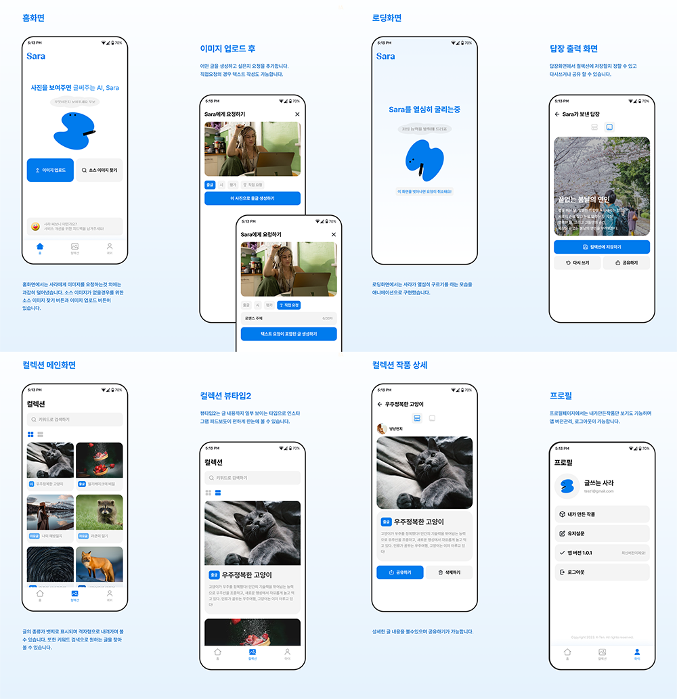

# Sara: 사진+Write
사용자의 사진을 분석해 작문해주는 AI 서비스 앱
 
 
 

### 주요기능
화면|내용|기능
------|---|---
로그인|Google 계정을 이용해 간편 로그인|- Google Login  - 자동 로그인
홈|사진을 업로드하거나 이미지 찾기를 이용해서 AI에게 이미지 분석을 요청|- 사진 업로드   1. 갤러리에서 가져오기   2. 카메라로 직접 찍어서 가져오기 - 사진 분석 요청 - 사진 분석 결과 컬렉션 저장 및 공유하기
컬렉션|다른 사람들이 공유한 사진과 내용을 볼 수 있는 갤러리|- 검색 - SNS 공유하기 및 복사하기 - 내 컬렉션에 저장하기 - 리스트형/앨범형 목록 
마이페이지|마이페이지|- 내 계정 정보 - 내 컬렉션 관리 - 유저 설문조사 - 로그아웃

 

## Skills
    
- **MVVM 디자인 패턴 : Flow, LiveData** 
  비동기 데이터 스트림을 수신하기 위해 LiveData를 Flow로 마이그레이션 
  → ViewModel은 remote에서 Flow를 통해 데이터를 얻어오고 View가 LiveData를 관찰하도록 리팩토링
- **의존성 주입 : Dagger-Hilt** 
  코드의 중복과 객체간 결합도 줄이기 위해 앱의 여러 컴포넌트에서 공통적으로 사용되는 객체를 한 곳에서 관리하는 SaraAppModule을 만들고, Hilt annotation을 사용해서 각각의 컴포넌트에서 의존성 주입하여 사용 
- **Jetpack** : Lifecycles, LiveData, ViewModel, DataBinding, Navigation
- **네트워크 통신 : Retrofit2, Okhttp3, Gson** 
  Json 방식을 활용하여 Sara 서버와 REST API 통신 
- **비동기 처리 : Coroutine, Flow** 
  Flow를 사용해 비동기 데이터 흐름 수신 
- **etc.**
  Google OAuth2.0 
  MotionLayout을 이용하여 캐릭터 애니메이션 구현 
  Glide 
  UI: ConstaintLayout, MotionLayout, RecyclerView, Lottie

 

## History

2023.2.26

코드 리팩토링 : ImageUploadViewModel 라이프사이클 문제 해결 

2023.2.23

코드 리팩토링 : LiveData → Flow로 마이그레이션 
패키지 구조 리팩토링

2023.6.4

코드 리팩토링 : 프래그먼트 메모리 누수 개선

   

2023.4.3

Sara 앱 완성

   
 

## Note
- [ImageResultViewModel 리팩토링](https://github.com/SANDY-9/Project_Sara/wiki/%5B2024.02.26%5D-ImageResultViewModel-%EB%A6%AC%ED%8C%A9%ED%86%A0%EB%A7%81) 
- [LiveData를 Flow로 마이그레이션 한 이유](https://github.com/SANDY-9/Project_Sara/wiki/%5B2024.02.23%5D-LiveData%EB%A5%BC-Flow%EB%A1%9C-%EB%A7%88%EC%9D%B4%EA%B7%B8%EB%A0%88%EC%9D%B4%EC%85%98) 
- [패키지 구조 개선 후 느낀 효과](https://github.com/SANDY-9/Project_Sara/wiki/%5B2024.02.24%5D-%ED%8C%A8%ED%82%A4%EC%A7%80%EA%B5%AC%EC%A1%B0-%EB%A6%AC%ED%8C%A9%ED%86%A0%EB%A7%81) 
- [기존 BaseFragment의 문제점과 리팩토링을 하게 된 이유](https://github.com/SANDY-9/Project_Sara/wiki/%5B2024.02.24%5D-BaseFragment-%EB%A6%AC%ED%8C%A9%ED%86%A0%EB%A7%81) 

 

## Links
+ Sara 시연영상 : [보러가기](https://drive.google.com/file/d/1G7sUwH7c1lvuCg9eniw_8kCr3wPiRuhD/view) 
+ Sara 개발기록 : [링크](https://reflective-goose-443.notion.site/Sara-187db945dd5e4075812482dcf35dd1aa?pvs=4) 
